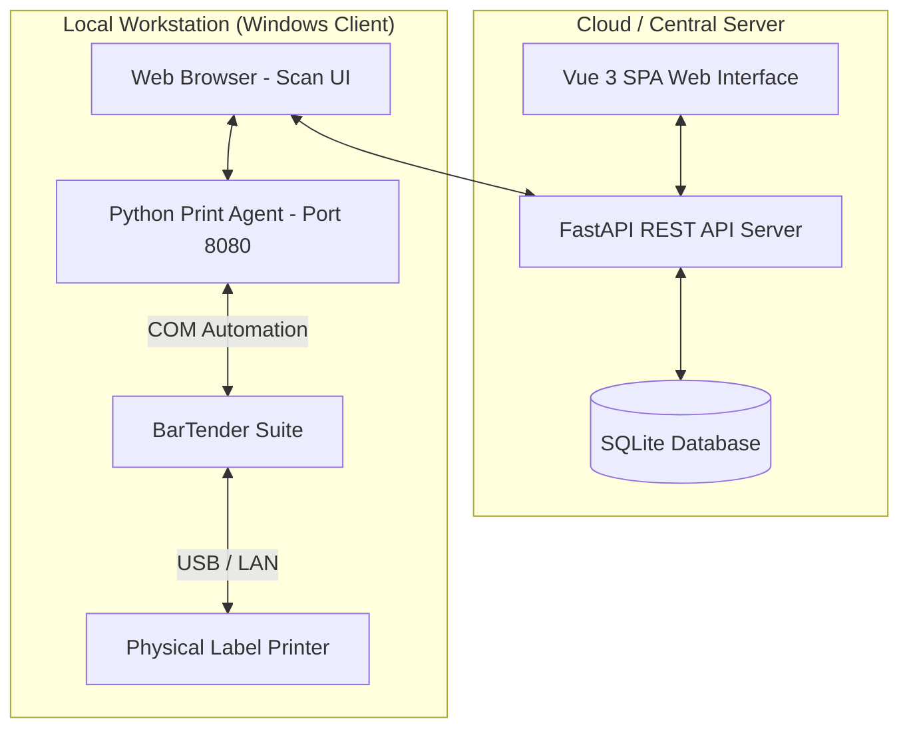

# NY Tagging System V2 📦🏷️

[](https://fastapi.tiangolo.com/)
[](https://vuejs.org/)
[](https://vitejs.dev/)
[](https://www.sqlite.org/)
[](https://www.seagullscientific.com/)
[](https://www.python.org/)

**NY Tagging System V2** là hệ thống quản lý đóng gói nâng cao và in nhãn thùng hàng (**Carton**) chất lượng cao, tích hợp trực tiếp với phần mềm thiết kế và in ấn nhãn chuyên nghiệp **BarTender** thông qua giao thức **COM Automation**. Hệ thống được thiết kế tối ưu cho dây chuyền đóng gói công nghiệp, đảm bảo tính độc bản của mã sê-ri thùng, kiểm soát chặt chẽ số lượng đóng gói và hỗ trợ in ấn siêu tốc tại các máy trạm local.

---

## 📖 Thuật ngữ Hệ thống (Domain Language)

Để đảm bảo tính nhất quán trong vận hành và lập trình, hệ thống tuân thủ nghiêm ngặt các thuật ngữ nghiệp vụ dưới đây:

*   **Customer (Khách hàng)**: Tổ chức hoặc đối tác sở hữu các sản phẩm cần được đóng gói và dán nhãn. *(Không gọi là: Client, đối tác, đối tác mua hàng)*.
*   **Product (Sản phẩm)**: Một loại sản phẩm thuộc về một *Customer*, định nghĩa các quy tắc đóng gói cụ thể (như số lượng tối đa mỗi thùng `packed_qty`, đường dẫn template tem nhãn `.btw`, tiền tố số sê-ri). *(Không gọi là: SKU, mã hàng)*.
*   **Carton (Thùng hàng)**: Một thùng chứa vật lý chứa các sản phẩm con bên trong, được định danh duy nhất bởi một mã sê-ri thùng (**Carton SN**). *(Không gọi là: Hộp, thùng chứa, kiện hàng)*.
*   **Carton SN (Mã sê-ri thùng)**: Mã định danh duy nhất của *Carton*, bắt đầu bằng tiền tố `CN` (viết tắt của **Carton Number**), theo sau là ngày tháng năm (`YYMM`), ký tự phân biệt sản phẩm và số thứ tự tự tăng 5 chữ số (Ví dụ: `CN2605A00001`). *(Không gọi là: Box SN, mã vạch thùng)*.
*   **Carton Item (Sản phẩm con)**: Một sản phẩm con riêng lẻ được quét bằng máy quét mã vạch để xếp vào thùng (*Carton*), được định danh bởi một mã sê-ri sản phẩm độc nhất (**Item SN**). *(Không gọi là: Serial sản phẩm, sê-ri quét)*.
*   **Job Order (Lệnh đóng gói)**: Mã lệnh sản xuất hoặc lệnh đóng gói dùng để nhóm nhiều *Carton* lại với nhau trong cùng một đợt chạy máy/sản xuất. *(Không gọi là: Lệnh sản xuất, mã lô, Work order)*.
*   **Print Agent (Ứng dụng in cục bộ)**: Ứng dụng client chạy ngầm trực tiếp trên máy tính Windows kết nối vật lý với máy in, giao tiếp với BarTender thông qua COM Automation để thực hiện lệnh in hoặc xuất PDF siêu tốc. *(Không gọi là: Client app, ứng dụng máy in, máy in dịch vụ)*.
*   **Printer (Thiết bị in)**: Thiết bị in nhãn vật lý (hoặc thiết bị ảo xuất PDF) nhận lệnh in trực tiếp từ *Print Agent*. *(Không gọi là: Máy in, print device)*.
*   **Origin Country (Xuất xứ sản xuất)**: Quốc gia sản xuất thực tế của thùng hàng (ví dụ: `VN` - Việt Nam hoặc `CN` - Trung Quốc), quyết định xuất xứ in trên nhãn hiển thị là "MADE IN VIETNAM" hay "MADE IN CHINA". *(Không gọi là: Quốc gia sê-ri)*.
*   **Reprint (In lại nhãn)**: Hành động in lại nhãn của một *Carton* đã được đóng gói trước đó. Hệ thống sẽ nhân bản bản ghi cũ với cờ `is_reprint=1` và giữ nguyên mã *Carton SN* ban đầu nhằm tránh làm tăng số thứ tự tự động của lô hàng. *(Không gọi là: In bù, in mới, in đè)*.
*   **Station ID (Trạm đóng gói)**: Mã định danh duy nhất của máy tính client hoặc máy trạm thực hiện lệnh in (thường được lưu dưới dạng địa chỉ MAC hoặc địa chỉ IP). *(Không gọi là: MAC ID, Terminal ID)*.
*   **Template Type (Loại nhãn)**: Cấu hình kiểu nhãn in cho từng dòng sản phẩm. Hỗ trợ 2 loại chính:
    *   `standard`: Chỉ hiển thị thông tin chung của Carton và mã vạch tổng.
    *   `detailed`: Hiển thị bảng danh sách mã vạch chi tiết của từng sản phẩm con (*Carton Item*) bên trong (hỗ trợ tối đa 40 dòng). *(Không gọi là: Cấu hình tem, kiểu mẫu)*.
*   **UPC (Mã vạch sản phẩm)**: Mã vạch sản phẩm tiêu chuẩn (Universal Product Code) tương ứng với từng *Product*, được in trực tiếp lên nhãn *Carton* để nhận diện ở cấp độ bán lẻ. *(Không gọi là: Mã vạch thùng, barcode sản phẩm)*.

---

## 🏗️ Kiến trúc Hệ thống

Hệ thống được thiết kế theo mô hình Client-Server phân tán tối ưu cho môi trường nhà xưởng:



1.  **Backend (FastAPI)**: Quản lý cơ sở dữ liệu SQLite (`database.db`), cung cấp RESTful APIs quản lý cấu hình Product, Customer, Job Order, kiểm tra tính hợp lệ của sê-ri quét và lưu vết lịch sử đóng gói.
2.  **Frontend (Vue 3 + Vite)**: Giao diện web SPA hiện đại dành cho công nhân quét mã sản phẩm con, kiểm soát số lượng đóng thùng trực quan, hiển thị cảnh báo lỗi tức thì khi quét trùng hoặc sai mã.
3.  **Local Print Agent (COM-based)**: Một ứng dụng nền siêu nhẹ bằng Python chạy trên các máy trạm đóng gói Windows, lắng nghe yêu cầu từ trình duyệt, tương tác trực tiếp với **BarTender COM Engine** để nạp file `.btw` và kích hoạt lệnh in ra **Printer** vật lý mà không gặp độ trễ hay hiển thị hộp thoại pop-up gây gián đoạn.

---

## 📂 Cấu trúc Thư mục Dự án

```text
NY_tagging_sys/
├── backend_v2/             # Backend API (FastAPI + SQLite)
│   ├── src/
│   │   ├── core/           # Cấu hình hệ thống, Database và Xử lý ngoại lệ
│   │   └── features/       # Các module nghiệp vụ (box, customer, history, product, print)
│   ├── static/             # Nơi chứa build tĩnh của Frontend để deploy Native
│   ├── tests/              # Test suite cho Backend (Pytest)
│   ├── database.db         # Cơ sở dữ liệu SQLite cục bộ
│   ├── main.py             # Entrypoint khởi chạy Backend FastAPI
│   └── requirements.txt    # Thư viện phụ thuộc của Backend
├── frontend_v2/            # Frontend SPA (Vue 3 + Vite + Composition API)
│   ├── src/                # Mã nguồn Vue (Components, Views, Assets)
│   ├── tests/              # Test suite cho Frontend (Vitest)
│   └── package.json        # Cấu hình thư viện Node.js
├── print_agent_v2/         # Windows Client Agent (BarTender COM Automation)
│   ├── agent.py            # FastAPI Agent chạy trên Local Port 8080/8082
│   ├── bartender_com.py    # Thư viện giao tiếp Win32 COM điều khiển BarTender
│   └── domain.py           # Quản lý định dạng dữ liệu in và phân giải XML dữ liệu nhãn
├── release/                # Thư mục đích sau khi build thành phẩm production (chứa EXE)
├── carton.ui.btw           # Mẫu nhãn BarTender Carton loại Standard
├── carton_2.btw            # Mẫu nhãn BarTender Carton loại Detailed (40 hàng)
├── build_v2.bat            # Script build đóng gói tự động toàn dự án sang .EXE
├── start_v2.bat            # Script khởi động nhanh toàn bộ các dịch vụ (Dev Mode)
├── run_tests.bat           # Script chạy tự động kiểm thử cả Backend & Frontend
└── render.yaml             # Cấu hình Blueprint để deploy native Python lên Render
```

---

## 🚀 Hướng dẫn Cài đặt & Chạy Dự án (Quick Start)

### 📋 Yêu cầu Hệ thống
*   **Hệ điều hành**: Windows 10/11 (Bắt buộc đối với trạm chạy máy in để tương tác với BarTender COM).
*   **Python**: Phiên bản `3.10` trở lên (Khuyến khích sử dụng công cụ quản lý package siêu tốc `uv`).
*   **Node.js**: Phiên bản `18.x` hoặc `20.x`.
*   **BarTender Enterprise/Automation**: Cần cài đặt trên trạm in để hỗ trợ tính năng COM Automation.

---

### 💻 Chế độ Phát triển (Development Mode)

Chỉ cần chạy tập tin batch tích hợp sẵn ở thư mục gốc để kích hoạt đồng thời 3 dịch vụ:
```powershell
./start_v2.bat
```
Script sẽ khởi động:
1.  **Backend V2**: `http://127.0.0.1:8001` (chạy qua `uv run uvicorn`)
2.  **Print Agent V2**: `http://127.0.0.1:8080` (chạy cục bộ kết nối BarTender)
3.  **Frontend V2**: `http://127.0.0.1:5173` (giao diện nhà máy)

---

### 🧪 Chạy Kiểm thử Tự động (Testing)

Hệ thống tích hợp bộ kiểm thử toàn diện cho cả Backend (Pytest) và Frontend (Vitest). Để thực hiện kiểm tra:
```powershell
./run_tests.bat
```

---

### 📦 Đóng gói Production (Windows Standalone .EXE)

Để triển khai hệ thống xuống nhà xưởng mà không cần cài đặt Python hay Node.js trên máy công nhân, sử dụng script đóng gói tự động:
```powershell
./build_v2.bat
```
Quy trình build tự động bao gồm:
1.  Biên dịch mã nguồn Frontend Vue 3 sang các tài nguyên tĩnh (`dist`).
2.  Đóng gói toàn bộ FastAPI Backend và các thư viện cần thiết thành gói thư mục thực thi độc lập tại `release/NY_Tagging_System`.
3.  Đóng gói Print Agent thành một file chạy duy nhất `release/NY_Print_Agent.exe` bằng **PyInstaller**.
4.  Cấu trúc lại thư mục `release/` chứa đầy đủ file chạy và môi trường cấu hình mẫu `.env` để bàn giao.

---

## 🔌 Cấu hình Chi tiết Print Agent & BarTender COM

### 1. Cơ chế hoạt động của COM Automation
Print Agent cục bộ sử dụng thư viện `win32com.client` để giao tiếp trực tiếp với động cơ nền của phần mềm BarTender. Khi nhận được yêu cầu in dưới dạng XML từ Frontend, Print Agent sẽ:
*   Khởi chạy tiến trình BarTender ẩn ở chế độ nền (không có cửa sổ hiển thị làm phiền người dùng).
*   Phân giải dữ liệu XML nhãn.
*   Nạp tệp mẫu thiết kế nhãn chỉ định (`.btw`).
*   Gán các giá trị trường động (Ví dụ: `CartonSN`, `Customer`, `Qty`, `Origin`) vào các **Named Data Sources** trong mẫu thiết kế.
*   Gọi lệnh `.Print()` trực tiếp đến driver máy in đích.

### 2. File cấu hình Agent (`config.json`)
Đặt file này tại cùng thư mục chạy của `NY_Print_Agent.exe` để cấu hình cổng hoạt động cục bộ:
```json
{
  "port": 8080
}
```

---

## ☁️ Hướng dẫn Triển khai Native trên Render

Hệ thống được cấu hình sẵn để triển khai trực tiếp lên đám mây Render dưới dạng ứng dụng Python tối ưu hiệu năng và dung lượng.

### 1. Chuẩn bị Frontend (Chạy dưới local máy dev)
Vì Render không thể build đồng thời môi trường Node.js và Python trên cùng một Web Service Free, chúng ta build Frontend trước ở local và nhúng trực tiếp vào static folder của Backend:
```powershell
# Chuyển tới frontend và build
cd frontend_v2
npm install
npm run build

# Dọn dẹp và copy dist sang static folder của Backend
Remove-Item -Recurse -Force ../backend_v2/static -ErrorAction SilentlyContinue
Copy-Item -Recurse dist ../backend_v2/static
```

### 2. Đồng bộ Database SQLite
Khởi tạo và xuất dữ liệu ban đầu ra SQLite file:
```powershell
cd ../backend_v2
uv run python export_to_sqlite.py
```

### 3. Đẩy lên GitHub & Tự động Deploy
Đảm bảo thư mục `backend_v2/static` và tệp `database.db` đã được add vào Git (không bị chặn bởi `.gitignore`), sau đó commit và push:
```powershell
git add .
git commit -m "deploy: native production bundle with static frontend"
git push
```
Render sẽ tự động đọc tệp `render.yaml` ở thư mục gốc để thiết lập dịch vụ web native Python trên hạ tầng Singapore, tự động cài đặt `requirements.txt` và khởi chạy server an toàn.

---

## ⚠️ Những Lưu ý Nghiệp vụ Đặc biệt

*   **Tránh nhầm lẫn ký tự `CN`**:
    *   Tiền tố mã Carton SN bắt đầu bằng `CN` luôn có ý nghĩa là **Carton Number** (Số thùng).
    *   Trong khi đó, biến quốc gia xuất xứ `Origin Country = CN` mới đại diện cho **China** (Trung Quốc). Hai khái niệm này hoàn toàn độc lập với nhau.
*   **Trường `packed_by` trong CSDL**: Trong cơ sở dữ liệu `cartons`, trường `packed_by` thực chất đang được cấu hình để lưu tên của **Printer** (Thiết bị in thực hiện nhãn) chứ không phải tên của công nhân đóng gói. Hãy chú ý khi viết các truy vấn báo cáo.
*   **Cơ chế Reprint an toàn**: Khi in lại nhãn, hệ thống ghi nhận một bản sao của Carton cũ với cờ `is_reprint=1` và giữ nguyên số Carton SN ban đầu để không phá vỡ tính tuần tự tự tăng của sê-ri thùng toàn hệ thống.
