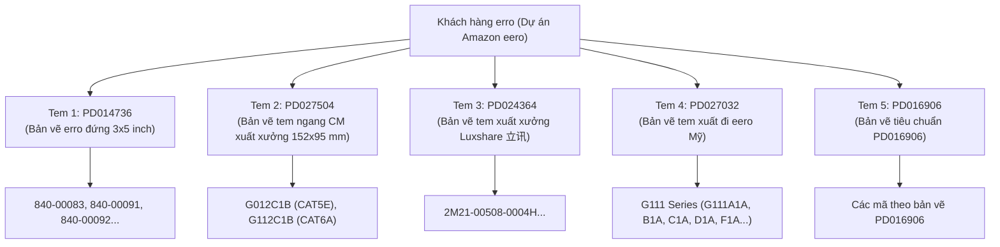

# Kiến Trúc Toàn Bộ Hệ Thống Tem Khách Hàng erro (Dự Án Amazon eero)

> **Tài liệu tham chiếu chuẩn cho các phiên làm việc và Sub-Agent.**  
> **Ngày cập nhật**: Tháng 09/2026  
> **Khách hàng**: `erro` (Dự án cáp mạng Amazon eero sản xuất tại Nien Yi)  
> **Thư mục tài nguyên mẫu**: `d:\Workspace\NY_tagging_sys\templates\erro\`

---

## 1. Bức Tranh Toàn Cảnh: Phân Loại 5 Dòng Tem Nhãn Khách Hàng erro

Toàn bộ hệ sinh thái đóng gói nhãn thùng (Carton) của khách hàng erro gồm **5 loại tem nhãn** tương ứng với từng kênh phân phối, đối tác lắp ráp (CM / Luxshare) và tiêu chuẩn xuất xưởng.

Mối quan hệ tổng thể được trích xuất trực tiếp từ [ERRO ITEM清单-B.xlsx](file:///d:/Workspace/NY_tagging_sys/templates/erro/ERRO%20ITEM清单-B.xlsx) (Sheet `格式贴纸` - Bảng Master Mapping):



### Bảng Master Mapping (Sheet `格式贴纸`):

| STT | SKU (Mã khách hàng) | Mã nội bộ xưởng (厂内料号) | Tem số (`对应贴纸`) | Mã bản vẽ kỹ thuật | Trạng thái (`生产状态`) | File mẫu BarTender | File bản vẽ PDF |
| :---: | :--- | :--- | :---: | :--- | :---: | :--- | :--- |
| 1 | `840-00092` | `1LAE0091C2U005MAAS` | **1** | `PD014736 REV.H` | Đã chạy | `第1.btw` | `第1PD014736 REV.H.pdf` |
| 2 | `840-00083` | `1LAX0091C2U004MAAS` | **1** | `PD014736 REV.H` | Đã chạy | `第1.btw` | `第1PD014736 REV.H.pdf` |
| 3 | `840-00091` | `1LAE0091C2U003MAAP` | **1** | `PD014736 REV.H` | Đã chạy | `第1.btw` | `第1PD014736 REV.H.pdf` |
| 4 | **`G012C1B`** | `1LAE0009D2U004MAAR` | **2** | **`PD027504 Rev C`** | **Đang sản xuất (在生产)** | `第2.btw` | `第2 纸箱标签PD027504.pdf` |
| 5 | **`G112C1B`** | `1LAE0009D2U002MAAS` | **2** | **`PD027504 Rev C`** | **Chuẩn bị chạy** | `第2.btw` | `第2 纸箱标签PD027504.pdf` |
| 6 | `2M21-00508-0004H` | `1LAE0091C2U011NMES` | **3** | `PD024364` | Đang sản xuất (在生产) | `第3 2M21-00508-0004 Tem NGOÀI.btw` | `第3 PD024364 立讯内外箱标签M.pdf` |
| 7 | `G111D1A` ... `G111F1C` | `1LAX0005F...` | **4** | `PD027032 REV.B` | Đã hoàn thành | `erro_04.btw` | `erro_04_PD027032.pdf` |
| 8 | 38 mã dự án NN9 | `1CAU...`, `1HWN...` | **5** | `PD016906 REV.I` | Đang triển khai | `erro_05.btw` | `erro_05_PD016906.pdf` |

---

## 2. So Sánh Kiến Trúc: Tem 1 (`PD014736`) vs Tem 2 (`PD027504`)

| Tiêu chí | Tem 1 (`PD014736`) | Tem 2 (`PD027504`) |
| :--- | :--- | :--- |
| **Kích thước** | $3 \times 5\text{ inch}$ ($76.2 \times 127\text{ mm}$), in dọc | $152 \times 95\text{ mm}$ (xấp xỉ $6 \times 3.74\text{ inch}$), in ngang |
| **Mã định danh Carton** | **PKG ID** (`CartonSN`):<br>`{Prefix}{YYMM}{Seq:06d}` | **Pallet SSCC (00)** (GS1-128 18 số):<br>`(00) 0 37033907 {Seq:07d} {CheckDigit}` |
| **Quy tắc Reset Sê-ri** | **Reset về `000001` vào 01/01 mỗi năm** | **KHÔNG BAO GIỜ RESET**, tăng liên tục từ `0000001` |
| **Mã vạch 1D** | 7 mã: CPN, QTY, MfrPN, DateCode, LotNo, PONo, PKG ID | 2 mã: **Pallet SSCC** (GS1-128) và **P/N** (Code 128) |
| **Mã vạch 2D** | Mã QR tổng hợp 7 trường: `P...,Q...,M...,D...,L...,K...,S...` | **HOÀN TOÀN KHÔNG CÓ MÃ QR** |
| **Trường bổ sung** | Lot Number, PO Number, Date Code (`YYWW`), Revision | **ASIN**, **Unit UPC**, **Product Name** (chuỗi mô tả dài) |
| **Xuất xứ (Origin)** | 1 dòng: `Made in Vietnam` hoặc `Made in China` | 3 dòng cố định (Anh - Pháp - Tây Ban Nha):<br>`ASSEMBLED IN VIETNAM`<br>`ASSEMBLE AU VIETNAM`<br>`HECHO EN VIETNAM` |
| **Chế độ đóng gói** | `weight_scale` (190 PCS/thùng hoặc 99 PCS/thùng) | `weight_scale` (190 PCS/thùng) |

---

## 3. Đặc Tả Chi Tiết Tem Số 2 (Bản Vẽ PD027504 Rev C)

### 3.1. Danh sách sản phẩm của Tem 2 (Trang 2 Bản vẽ - Bảng 1)

| STT | Item (SKU) | Unit UPC | ASIN | P/N (Mfr P/N) | QTY / Carton | Product Name (Mô tả chi tiết trên tem) |
| :---: | :---: | :---: | :---: | :---: | :---: | :--- |
| **1** | `G112C1B` | `840268969493` | `B0C32N712K` | `NYS5996` | 190 | `ASSY, BAND WRAPPED, CAT6A ETHERNET CABLE 4.7MM OD, 91CM , WHITE,RUBBER BAND` |
| **2** | `G012C1B` | `852582006785` | `B08G9M4HXS` | `NYS5998` | 190 | `ASSY, BAND WRAPPED, CAT5E ETHERNET CABLE 4.0MM OD, 91CM, WHITE,RUBBER BAND` |

### 3.2. Cấu trúc các trường trên Tem 2

```text
+-------------------------------------------------------------------+--------------------+
| Product name: ASSY, BAND WRAPPED, CAT5E ETHERNET CABLE             | QTY/Carton: 190    |
|               4.0mm OD:91CM, WHITE, RUBBER BAND                   |                    |
+-------------------------------------------------------------------+--------------------+
|                                                                                        |
|   ||||||||||||||||||||||||||||||||||||||||||||||||||||||||||||||||||||||||||||||||||   |
|                         Pallet SSCC  (00) 0 37033907 0000001 3                         |
|                                                                                        |
+------------------------------------+---------------------------------------------------+
|                                    | PN: NYS5998                                       |
|                                    | |||||||||||||||||||||||||||||||||||||||||||       |
|                                    +---------------------------------------------------+
|                                    | ASIN: B08G9M4HXS                                  |
|                                    +---------------------------------------------------+
|                                    | Unit UPC: 852582006785                            |
|                                    +---------------------------------------------------+
|                                    | ASSEMBLED IN VIETNAM                              |
|                                    | ASSEMBLE AU VIETNAM                               |
|                                    | HECHO EN VIETNAM                                  |
+------------------------------------+---------------------------------------------------+
```

1. **Product Name** (Ô trên bên trái): Text Arial, lấy chuỗi mô tả chính xác của mã hàng.
2. **QTY/Carton** (Ô trên bên phải): Text Arial 10pt: `QTY/Carton: {packed_qty}` (mặc định 190).
3. **Pallet SSCC Barcode & Text** (Khối giữa):
   - Mã vạch: Chiều cao 20mm, chuẩn GS1-128 (hoặc Code 128 với AI 00).
   - Text hiển thị bên dưới: `Pallet SSCC  (00) 0 37033907 {7 số sê-ri} {Check Digit}`.
4. **PN & Barcode** (Ô phải hàng 1):
   - Text: `PN: {mfr_pn}` (hoặc `P/N :{mfr_pn}`).
   - Mã vạch: Code 128, chiều cao 6mm, nội dung mã hóa là `{mfr_pn}` (ví dụ: `NYS5998` hoặc `NYS5996`).
5. **ASIN** (Ô phải hàng 2): Text Arial 6pt: `ASIN: {asin}`.
6. **Unit UPC** (Ô phải hàng 3): Text Arial 6pt: `Unit UPC: {upc}`.
7. **Origin** (Ô phải hàng 4): Text Arial 6pt cố định 3 dòng:
   ```text
   ASSEMBLED IN VIETNAM
   ASSEMBLE AU VIETNAM
   HECHO EN VIETNAM
   ```

---

## 4. Thuật Toán Sinh Mã Pallet SSCC Chuẩn GS1

### 4.1. Quy cách cấu tạo 18 chữ số:
$$\text{Data String (17 số)} = \underbrace{\text{0}}_{\text{Extension}} + \underbrace{\text{37033907}}_{\text{Nien Yi GS1 Company Prefix (8 số)}} + \underbrace{\text{Seq:07d}}_{\text{Serial No (7 số)}}$$
$$\text{Full SSCC (18 số)} = \text{Data String (17 số)} + \underbrace{\text{Check Digit (1 số)}}_{\text{Modulo 10}}$$

- **Extension Digit**: Cố định là `0`.
- **Mã công ty (Company Prefix)**: Cố định là `37033907` (Mã GS1 duy nhất của Nien Yi).
- **Serial Sequence**: 7 chữ số từ `0000001` đến `9999999`. **Không reset theo năm hay tháng**, tăng lũy tiến liên tục.
- **Check Digit**: Tính bằng thuật toán trọng số $3-1$ của GS1.

### 4.2. Công thức tính Check Digit (Modulo 10):
Duyệt chuỗi Data String từ phải sang trái (bắt đầu từ chữ số cuối cùng sát Check Digit):
- Nhân các vị trí lần lượt với trọng số luân phiên: $3, 1, 3, 1, 3, 1...$
- Cộng tổng các tích lại thành $S$.
- Tìm bội số của 10 nhỏ nhất lớn hơn hoặc bằng $S$, lấy hiệu số đó trừ đi $S$:
  $$\text{Check Digit} = (10 - (S \pmod{10})) \pmod{10}$$

### 4.3. Code mẫu Python chuẩn hóa (đã xác thực với Bảng tính và Bản vẽ):

```python
def calculate_gs1_check_digit(number_str: str) -> int:
    """Tính mã kiểm tra Check Digit chuẩn GS1 cho chuỗi số bất kỳ (SSCC-18, GTIN, UPC)."""
    clean_str = "".join(c for c in number_str if c.isdigit())
    total = 0
    weights = [3, 1]  # Bắt đầu từ phải sang trái: vị trí đầu tiên nhân 3, tiếp theo nhân 1
    for i, char in enumerate(reversed(clean_str)):
        weight = weights[i % 2]
        total += int(char) * weight
    remainder = total % 10
    return 0 if remainder == 0 else (10 - remainder)

# Kiểm chứng thực tế:
# Serial 1000286 -> Data: 0370339071000286 -> Check Digit = 1 (Trang 2 bản vẽ)
# Serial 0000001 -> Data: 0370339070000001 -> Check Digit = 3 (File mẫu 第2.btw)
```

---

## 5. Thiết Kế Tích Hợp Kỹ Thuật (Implementation Plan)

### 5.1. Database Schema (`backend_v2/src/core/models.py`)
Mở rộng bảng `Product` để lưu trữ các metadata mới của Tem 2 mà không phá vỡ Tem 1:
- `template_type`: Thêm giá trị `"erro_tem2"` (hoặc `"erro_sscc"`).
- `factory_pn`: `Column(String(100), nullable=True)` — Lưu mã nội bộ xưởng (厂内料号, ví dụ `1LAE0009D2U004MAAR`, `1LAE0009D2U002MAAS`) phục vụ tìm kiếm/tra cứu trên Web UI và đối chiếu BOM.
- `asin`: `Column(String(50), nullable=True)` — Lưu ASIN (ví dụ `B08G9M4HXS`, `B0C32N712K`).
- `product_desc`: `Column(String(255), nullable=True)` — Lưu mô tả dài cho `Product name`.
- `sscc_seq`: Dùng chung bộ đếm tự tăng toàn cục theo tiền tố doanh nghiệp `037033907` (bắt đầu từ `0000001` đến `9999999`, không bao giờ reset).

### 5.2. File BarTender Template (`D:\PAT\Templates\erro_02.btw`)
File tem đã được cấu hình và kiểm chứng hoạt động 100% qua BarTender COM với **7 Named SubStrings** chuẩn:
1. **`ProductName`**: Chuỗi mô tả đầy đủ kèm tiền tố (`Product name:{product_desc}`)
2. **`QTY`**: Số lượng đóng gói (`{qty}`, ví dụ `190`)
3. **`SSCC_Text`**: Chuỗi dữ liệu SSCC liên kết đồng thời với cả Text hiển thị và Mã vạch SSCC (`(00) 0 37033907 {seq:07d}`)
4. **`SSCC_CD`**: Chữ số kiểm tra Check Digit (`{cd}`, tính tự động Modulo 10)
5. **`PN`**: Mã P/N của Nien Yi (`{mfr_pn}`, ví dụ `NYS5998` / `NYS5996`), liên kết đồng thời cho Text hiển thị và Mã vạch P/N
6. **`ASIN`**: Mã định danh Amazon ASIN (`{asin}`, ví dụ `B08G9M4HXS` / `B0C32N712K`)
7. **`UnitUPC`**: Mã Unit UPC bán lẻ (`{upc}`, ví dụ `852582006785` / `840268969493`)

> [!NOTE]
> Khối xuất xứ 3 dòng (`ASSEMBLED IN VIETNAM / ASSEMBLE AU VIETNAM / HECHO EN VIETNAM`) là text tĩnh cố định trên tem bản vẽ Việt Nam, không cần NamedSubString.

### 5.3. In ấn & BTXML Document (`backend_v2/src/features/print/domain.py`)
- Tạo template XML `backend_v2/src/features/print/templates/erro_tem2.xml`.
- Bổ sung logic phân nhánh trong `BTXMLDocument.from_carton_data`: Khi `template_type == "erro_tem2"`, tự động sinh mã SSCC, tính Check Digit, và fill các NamedSubStrings của Tem 2.

### 5.4. Quy trình Cân & Đóng Gói (Packing UI & Weight Scale)
- Tem 2 chạy chế độ `weight_scale`.
- **PO Number & Lot Number**: Hệ thống cho phép để rỗng (không bắt buộc nhập) khi đóng gói con hàng Tem 2. Màn hình Cân tự động bỏ qua (bypass) popup bắt buộc nhập Batch PO/Lot, nhưng vẫn cho phép bấm sửa nếu cần.
- **Trọng lượng (Weight Tolerance)**: Cấu hình ban đầu dải cân giả lập (ví dụ `min_weight = 5.0kg`, `max_weight = 7.0kg`, `target_weight = 6.0kg`) để thông luồng, người dùng có thể điều chỉnh lại trên màn hình Quản trị Sản phẩm.
- Khi công nhân đặt thùng hàng 190 con lên cân và nhấn In (`F9`), hệ thống xác thực `Weight Tolerance`, cấp phát sê-ri SSCC tiếp theo, tính Check Digit, lưu bản ghi Carton với `carton_sn = "037033907{seq:07d}{cd}"` và gửi lệnh in sang Print Agent.

---

## 6. Đặc Tả Chi Tiết & Thiết Kế Kiến Trúc Tem Số 3 (Bản Vẽ PD024364 - Luxshare NME)

### 6.1. Thông Tin Nhận Diện & Sản Phẩm Đại Diện
- **Bản vẽ kỹ thuật**: `PD024364 REV.M` (立讯NME外箱贴纸 - Tem thùng ngoài NME Luxshare).
- **Kích thước tem**: $100 \times 80\text{ mm}$ (in ngang).
- **Mã sản phẩm đại diện**: `2M21-00508-0004H` (厂内料号: `1LAE0091C2U011NMES`).
- **Dự án & Giai đoạn sản xuất**: `Andy Town/ Firefly` | `QB/CR` (hoặc `MP`).
- **Mã nhà cung ứng & Xuất xứ**:
  - Mã NCC xưởng Việt Nam: **`1012665`** (cấu hình trong `Product.pkg_prefix`).
  - Tên nhà cung ứng: `NIENYI VIETNAM INDUSTRIAL COMPANY LIMITED`.
  - Nguyên sản địa (Origin): `VIETNAM`.

### 6.2. Quy Tắc Sinh Mã Thùng (Carton SN)
Theo đúng Ghi chú G trên bản vẽ `PD024364 REV.M`:
$$\text{Carton SN (17 ký tự)} = \underbrace{\text{1012665}}_{\text{Supplier Code (7 số)}} + \underbrace{\text{YYMMDD}}_{\text{Thời gian SX (6 số)}} + \underbrace{\text{Seq:04d}}_{\text{Mã sen / Sê-ri (4 số)}}$$

- **Reset sê-ri**: Bộ đếm sê-ri 4 chữ số `{Seq:04d}` (từ `0001` đến `9999`) **tự động reset về `0001` vào 00:00 mỗi ngày mới** (`YYMMDD` theo giờ cục bộ của máy chủ nhà máy).
- **Chống trùng lặp**: Sử dụng truy vấn `with_for_update()` khóa dòng cấp phát sê-ri theo ngày, bảo đảm an toàn dữ liệu tuyệt đối khi nhiều cân thao tác song song.

### 6.3. Cấu Trúc Mã Vạch 2D QR Code
Theo đúng quy cách mã hóa phân cách bằng ký tự `$` trên bản vẽ:
```text
{CartonSN}${SupplierCode}${SupplierName}${PartNo}${APNRev}${LotNo}${DateYYYYMMDD}${QTY}$$$$$$
```
*Ví dụ thực tế*:
`10126652609110001$1012665$NIENYI VIETNAM INDUSTRIAL COMPANY LIMITED$2M21-00508-0004H$$92607933$20260911$190$$$$$$`

### 6.4. Cấu Hình File BarTender Template (`D:\PAT\Templates\erro_03.btw`)
- **Tên file chuẩn hóa**: `erro_03.btw` (sao chép và cấu hình từ `第3 2M21-00508-0004 Tem NGOÀI.btw`).
- **Mã loại tem (`template_type`)**: `"erro_tem3"`.
- **Danh sách Named SubStrings chuẩn**:
  1. `ProjectStage`: Dòng tiêu đề dự án & giai đoạn (`项目: Andy Town/ Firefly         生产阶段：QB/CR`)
  2. `PartNo`: Mã vật liệu Luxshare (`料号: {part_no}`)
  3. `APNRev`: Phiên bản APN (`APN-Rev : {apn_rev}`)
  4. `QTY`: Số lượng đóng gói (`数量: {qty}`)
  5. `Date`: Ngày sản xuất dạng `YYYYMMDD` (`生产日期: {date_ymd}`)
  6. `LotNo`: Số lô sản xuất (`生产批号: {lot_no}`)
  7. `PartDesc`: Mô tả linh kiện (`料件描述: {part_desc}`)
  8. `SupplierCode`: Mã nhà cung ứng (`供应商代码: {supplier_code}`)
  9. `CartonSN`: Mã định danh thùng 17 ký tự (`箱号: {carton_sn}`)
  10. `SupplierName`: Tên nhà cung ứng (`供应商名称：{supplier_name}`)
  11. `Origin`: Xuất xứ (`原产地：{origin}`)
  12. `QRCode_Content`: Chuỗi nội dung tổng hợp mã 2D truyền trực tiếp vào Barcode QR.

### 6.5. Quy Trình Vận Hành & Cân Đóng Gói (Packing UI)
- Chế độ đóng gói: **`weight_scale`** (cân điện tử và in nhãn Carton khi đạt dung sai `Weight Tolerance`).
- **PO Number**: Mặc định cho phép để rỗng (bypass popup bắt buộc PO như Tem 2), cho phép người dùng tùy ý chỉnh sửa nếu có PO cụ thể.
- **Lot Number**: Mặc định lấy từ metadata sản phẩm/bản vẽ, cho phép người vận hành chỉnh sửa linh hoạt trên giao diện ca đóng gói như Tem 1.
- **Chính sách In lại (Reprint)**: **Tuyệt đối cấm in lại tem cũ (No Reprint)** theo quyết định kiến trúc `ADR-0005`. Tem lỗi/rách được xử lý bằng thao tác in ngay tem tiếp theo với số thứ tự mới.

---

## 7. Đặc Tả Chi Tiết & Thiết Kế Kiến Trúc Tem Số 5 (Bản Vẽ PD016906 - Pegatron NN9)

### 7.1. Thông Tin Nhận Diện & Phạm Vi Áp Dụng
- **Bản vẽ kỹ thuật**: `NY1107103E(PD016906)` Rev I (Bản vẽ tem mã vạch NN9 bao bì bên ngoài / 外包装).
- **Kích thước tem**: $102 \times 77\text{ mm}$ (in tem trắng `30510000F030`).
- **Phông chữ chuẩn**: Verdana (theo ghi chú bản vẽ).
- **Khách hàng / Đối tác**: `PEGATRON` (Dự án NN9).
- **Mã loại tem (`template_type`)**: `"erro_05"`.
- **File mẫu BarTender**: `D:\PAT\Templates\erro_05.btw`.
- **Danh mục áp dụng**: Toàn bộ 38 mã hàng dự án NN9 (Trang 3 bản vẽ), ví dụ mã đại diện: `1414-0GDA0BV` (`1HWU3023C1XX02NN9` - `X LED CABLE 30AWG 230mm`).

### 7.2. Quy Tắc Sinh Mã Thùng (Carton SN)
Theo đúng ghi chú kỹ thuật trên bản vẽ `PD016906`:
$$\text{Carton No (18 ký tự)} = \underbrace{\text{MC220TW1}}_{\text{pkg\_prefix}} + \underbrace{\text{2}}_{\text{Ký tự cố định}} + \underbrace{\text{YY}}_{\text{Năm (2 số)}} + \underbrace{\text{WW}}_{\text{Tuần (2 số)}} + \underbrace{\text{Seq:05d}}_{\text{Sê-ri 5 số}}$$

- **Tiền tố nhà cung ứng (`pkg_prefix`)**: Mặc định là `MC220TW1`, được cấu hình trong phân hệ Quản trị (Admin), khóa không cho phép sửa đổi tại giao diện trạm đóng gói.
- **Ký tự cố định**: Số `2` (theo quy cách bản vẽ Pegatron).
- **Thời gian sản xuất**: `YY` (2 chữ số cuối của năm) + `WW` (2 chữ số tuần trong năm theo ISO).
- **Bộ đếm sê-ri 5 chữ số**:
  - Dải sê-ri xưởng Việt Nam: **`50001` – `99999`**.
  - **Reset sê-ri**: Tự động reset về `50001` vào lúc 00:00:00 ngày đầu tiên của mỗi tháng mới (`YYYY-MM` theo giờ cục bộ của máy chủ nhà máy).
  - Dùng chung một bộ đếm thống nhất cho toàn bộ danh mục sản phẩm `erro_05`, không tách riêng theo mã hàng hay tuần sản xuất.
- **Chống trùng lặp & Khóa hàng**: Cấp phát sê-ri sử dụng cơ chế khóa hàng bảo đảm an toàn dữ liệu tuyệt đối khi nhiều cân thao tác đồng thời.

### 7.3. Cấu Trúc Mã Vạch 1D & 2D QR Code
- **Mã vạch 1D (Code 128)** gồm 5 mã:
  1. `Carton No`: Mã hóa chuỗi `{carton_sn}` (18 ký tự).
  2. `P/N`: Mã hóa mã Item của Pegatron (`{item_name}`, ví dụ `1414-0GDA0BV`).
  3. `Date Code`: Mã hóa mã tuần `{date_code}` (`YYWW`, ví dụ `2637`).
  4. `Lot Code`: Mã hóa ngày sản xuất `{lot_code}` (`YYYYMMDD`, ví dụ `20260912`).
  5. `QTY`: Mã hóa số lượng đóng gói `{qty}` (ví dụ `1000`).
- **Mã vạch 2D QR Code**:
  Tổng hợp 7 trường dữ liệu phân cách bằng dấu phẩy:
  ```text
  {CartonNo},{Item},{MPN},{Batch},{QTY},{DateCode},{LotCode}
  ```
  *Ví dụ thực tế*:
  `MC220TW12263750001,1414-0GDA0BV,,,1000,2637,20260912`  
  *(Các trường rỗng như MPN, Batch giữ nguyên vị trí phân cách bằng dấu phẩy)*.

### 7.4. Cấu Hình BarTender Template & 12 Named SubStrings (`erro_05.btw`)
1. `CartonNo`: Mã thùng 18 ký tự (`{carton_sn}`)
2. `Item`: Mã linh kiện Pegatron (`{item_name}`)
3. `DESC`: Mô tả quy cách (`{product_desc}`)
4. `DateCode`: Tuần sản xuất `YYWW` (`{date_code}`)
5. `LotCode`: Ngày sản xuất `YYYYMMDD` (`{lot_code}`)
6. `QTY`: Số lượng đóng gói (`{qty}`)
7. `QRCode_Content`: Chuỗi nội dung nạp vào mã QR 2D
8. `MPN`: Mã MPN (mặc định `""`)
9. `Rev`: Phiên bản khách hàng (lấy từ `Product.revision`, nếu không có thì `""`)
10. `Config`: Cấu hình (mặc định `""`)
11. `Batch`: Mã Batch (mặc định `""`, hoặc lấy từ ca đóng gói nếu có nhập)
12. `Stage`: Công đoạn sản xuất (mặc định `""`)

### 7.5. Quy Trình Vận Hành & Cân Đóng Gói (Packing UI)
- **Chế độ đóng gói**: `weight_scale` (xác thực dải cân `Weight Tolerance` trước khi cấp phát số Carton SN và in nhãn).
- **Date Code**: Tính tự động từ giờ máy chủ nhà máy lúc in.
- **Lot Code**: Mặc định tự động sinh theo ngày `YYYYMMDD` của thời điểm in, người vận hành có thể điều chỉnh trên giao diện ca đóng gói nếu xưởng có mã lô riêng.
- **PO Number & Batch**: Cho phép để trống mặc định (bypass popup bắt buộc PO), cho phép nhập tùy chọn.
- **Chính sách In lại (Reprint)**: Tuyệt đối cấm in lại tem cũ (No Reprint) theo quyết định `ADR-0005`.


