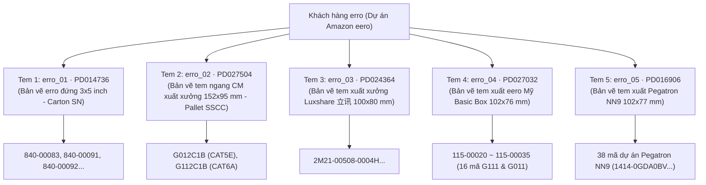

# Kiến Trúc Toàn Bộ Hệ Thống Tem Khách Hàng erro (Dự Án Amazon eero)

> **Tài liệu tham chiếu chuẩn cho các phiên làm việc và Sub-Agent.**  
> **Ngày cập nhật**: Tháng 09/2026 (Hoàn thiện đồng bộ 5/5 mẫu tem)  
> **Khách hàng**: `erro` (Dự án cáp mạng Amazon eero sản xuất tại Nien Yi)  
> **Thư mục tài nguyên mẫu**: `d:\Workspace\NY_tagging_sys\templates\erro\`  
> **Thư mục mẫu BarTender chuẩn**: `D:\PAT\Templates\`

---

## 1. Bức Tranh Toàn Cảnh: Phân Loại 5 Dòng Tem Nhãn Khách Hàng erro

Toàn bộ hệ sinh thái đóng gói nhãn thùng (Carton) của khách hàng erro gồm **5 loại tem nhãn** tương ứng với từng kênh phân phối, đối tác lắp ráp (CM / Luxshare / Pegatron) và tiêu chuẩn xuất xưởng.

Mối quan hệ tổng thể được trích xuất trực tiếp từ [ERRO ITEM清单-B.xlsx](file:///d:/Workspace/NY_tagging_sys/templates/erro/ERRO%20ITEM清单-B.xlsx) (Sheet `格式贴纸` - Bảng Master Mapping):



### 1.1. Bảng Master Mapping 5 Mẫu Tem Chuẩn Hóa:

| STT | Mã hệ thống (`template_type`) | File BarTender (`.btw`) | Mã bản vẽ kỹ thuật | Quy cách kích thước | Đối tượng / Đối tác áp dụng | Quy định Sê-ri Thùng | Trạng thái |
| :---: | :---: | :---: | :---: | :---: | :---: | :---: | :---: |
| **1** | `erro_01` | `erro_01.btw` | `PD014736 REV.H` | $76.2 \times 127\text{ mm}$ (dọc) | eero Retail / Direct | `{Prefix}{YYMM}{Seq:06d}`, reset 01/01 hàng năm | Đã chạy sản xuất |
| **2** | `erro_02` | `erro_02.btw` | `PD027504 Rev C` | $152 \times 95\text{ mm}$ (ngang) | CM xuất xưởng | Pallet SSCC-18, tăng lũy tiến không reset | Đã chạy sản xuất |
| **3** | `erro_03` | `erro_03.btw` | `PD024364 REV.M` | $100 \times 80\text{ mm}$ (ngang) | Luxshare 立讯 (NME) | `1012665{YYMMDD}{Seq:04d}`, reset 01/01 hàng năm | Đã chạy sản xuất |
| **4** | `erro_04` | `erro_04.btw` | `PD027032 REV.B` | $102 \times 76\text{ mm}$ (ngang) | eero Basic Box (1PK) | `{H/K}{YMD:Base32}{Seq:4-char Base32}`, reset 01/01 hàng năm | Đã chạy sản xuất |
| **5** | `erro_05` | `erro_05.btw` | `PD016906 REV.I` | $102 \times 77\text{ mm}$ (ngang) | Pegatron (Dự án NN9) | `MC220TW12{YYWW}{Seq:50001-99999}`, reset ngày 1 hàng tháng | Đã chạy sản xuất |

---

### 1.2. Bảng Ma Trận Quy Định Bắt Buộc PO & LOT Khi Cân In:

| Mẫu Tem | Mã template | Bắt buộc nhập PO? | Bắt buộc nhập LOT? | Cơ chế xử lý nếu để trống |
| :---: | :---: | :---: | :---: | :--- |
| **Tem 01** | `erro_01` | **BẮT BUỘC** | **BẮT BUỘC** | Chặn in tại frontend & backend nếu thiếu. Mã QR chứa `K{PO},L{LOT}`. |
| **Tem 02** | `erro_02` | **KHÔNG** | **KHÔNG** | Không áp dụng. Chuẩn nhãn SSCC không có ô in hay barcode PO/LOT. Bỏ qua nhập liệu. |
| **Tem 03** | `erro_03` | **KHÔNG** | **KHÔNG** | PO tùy chọn. LOT tự động nạp mặc định `92607933` (quy định Luxshare) nếu người dùng để trống. |
| **Tem 04** | `erro_04` | **BẮT BUỘC** | **BẮT BUỘC** | Chặn in tại cả trạm cân frontend và API backend (`400 Bad Request`). |
| **Tem 05** | `erro_05` | **KHÔNG** | **KHÔNG** | PO tùy chọn (ghi vào trường `Batch` QR nếu có). LOT tự động sinh `YYYYMMDD` ngày hiện tại nếu để trống. |

---

## 2. So Sánh Kiến Trúc: Tem 1 (`PD014736`) vs Tem 2 (`PD027504`)

| Tiêu chí | Tem 1 (`PD014736`) | Tem 2 (`PD027504`) |
| :--- | :--- | :--- |
| **Kích thước** | $3 \times 5\text{ inch}$ ($76.2 \times 127\text{ mm}$), in dọc | $152 \times 95\text{ mm}$ (xấp xỉ $6 \times 3.74\text{ inch}$), in ngang |
| **Mã định danh Carton** | **PKG ID** (`CartonSN`):<br>`{Prefix}{YYMM}{Seq:06d}` | **Pallet SSCC (00)** (GS1-128 18 số):<br>`(00) 0 37033907 {Seq:07d} {CheckDigit}` |
| **Quy tắc Reset Sê-ri** | **Reset về `000001` vào 01/01 mỗi năm** | **KHÔNG BAO GIỜ RESET**, tăng liên tục từ `0000001` |
| **Mã vạch 1D** | 7 mã: CPN, QTY, MfrPN, DateCode, LotNo, PONo, PKG ID | 2 mã: **Pallet SSCC** (GS1-128) và **P/N** (Code 128) |
| **Mã vạch 2D** | Mã QR tổng hợp 7 trường: `P...,Q...,M...,D...,L...,K...,S...` | **HOÀN TOÀN KHÔNG CÓ MÃ QR** |
| **Trường bổ sung** | Lot Number, PO Number, Date Code (`YYWW`), Revision | **ASIN**, **Unit UPC**, **Product Name** (chuỗi mô tả dài) |
| **Xuất xứ (Origin)** | 1 dòng: `Made in Vietnam` hoặc `Made in China` | 3 dòng cố định (Anh - Pháp - Tây Ban Nha):<br>`ASSEMBLED IN VIETNAM`<br>`ASSEMBLE AU VIETNAM`<br>`HECHO EN VIETNAM` |
| **Chế độ đóng gói** | `weight_scale` (190 PCS/thùng hoặc 99 PCS/thùng) | `weight_scale` (190 PCS/thùng) |

---

## 3. Đặc Tả Chi Tiết Tem Số 2 (Bản Vẽ PD027504 Rev C - Pallet SSCC)

### 3.1. Danh sách sản phẩm của Tem 2 (Trang 2 Bản vẽ - Bảng 1)

| STT | Item (SKU) | Unit UPC | ASIN | P/N (Mfr P/N) | QTY / Carton | Product Name (Mô tả chi tiết trên tem) |
| :---: | :---: | :---: | :---: | :---: | :---: | :--- |
| **1** | `G112C1B` | `840268969493` | `B0C32N712K` | `NYS5996` | 190 | `ASSY, BAND WRAPPED, CAT6A ETHERNET CABLE 4.7MM OD, 91CM , WHITE,RUBBER BAND` |
| **2** | `G012C1B` | `852582006785` | `B08G9M4HXS` | `NYS5998` | 190 | `ASSY, BAND WRAPPED, CAT5E ETHERNET CABLE 4.0MM OD, 91CM, WHITE,RUBBER BAND` |

### 3.2. Thuật Toán Sinh Mã Pallet SSCC Chuẩn GS1
$$\text{Data String (17 số)} = \underbrace{\text{0}}_{\text{Extension}} + \underbrace{\text{37033907}}_{\text{Nien Yi GS1 Company Prefix (8 số)}} + \underbrace{\text{Seq:07d}}_{\text{Serial No (7 số)}}$$
$$\text{Full SSCC (18 số)} = \text{Data String (17 số)} + \underbrace{\text{Check Digit (1 số)}}_{\text{Modulo 10}}$$

- **Extension Digit**: Cố định là `0`.
- **Mã công ty (Company Prefix)**: Cố định là `37033907` (Mã GS1 duy nhất của Nien Yi).
- **Serial Sequence**: 7 chữ số từ `0000001` đến `9999999`. **Không reset theo năm hay tháng**, tăng lũy tiến liên tục.
- **Check Digit**: Tính bằng thuật toán trọng số $3-1$ của GS1:
  $$\text{Check Digit} = (10 - (S \pmod{10})) \pmod{10}$$

### 3.3. Cấu Hình BarTender Template & 7 Named SubStrings (`erro_02.btw`)
1. **`ProductName`**: Chuỗi mô tả đầy đủ kèm tiền tố (`Product name:{product_desc}`)
2. **`QTY`**: Số lượng đóng gói (`{qty}`, ví dụ `190`)
3. **`SSCC_Text`**: Chuỗi dữ liệu SSCC liên kết đồng thời với cả Text hiển thị và Mã vạch SSCC (`(00) 0 37033907 {seq:07d}`)
4. **`SSCC_CD`**: Chữ số kiểm tra Check Digit (`{cd}`)
5. **`PN`**: Mã P/N của Nien Yi (`{mfr_pn}`, ví dụ `NYS5998` / `NYS5996`)
6. **`ASIN`**: Mã định danh Amazon ASIN (`{asin}`)
7. **`UnitUPC`**: Mã Unit UPC bán lẻ (`{upc}`)

---

## 4. Đặc Tả Chi Tiết Tem Số 3 (Bản Vẽ PD024364 - Luxshare NME)

### 4.1. Thông Tin Nhận Diện & Sản Phẩm Đại Diện
- **Bản vẽ kỹ thuật**: `PD024364 REV.M` (立讯NME外箱贴纸 - Tem thùng ngoài NME Luxshare).
- **Kích thước tem**: $100 \times 80\text{ mm}$ (in ngang).
- **Mã sản phẩm đại diện**: `2M21-00508-0004H` (厂内料号: `1LAE0091C2U011NMES`).
- **Dự án & Giai đoạn**: `Andy Town/ Firefly` | `QB/CR` (hoặc `MP`).
- **Mã nhà cung ứng & Xuất xứ**:
  - Mã NCC xưởng Việt Nam: **`1012665`** (cấu hình trong `Product.pkg_prefix`).
  - Tên nhà cung ứng: `NIENYI VIETNAM INDUSTRIAL COMPANY LIMITED`.
  - Xuất xứ: `VIETNAM`.

### 4.2. Quy Tắc Sinh Mã Thùng (Carton SN)
Theo Ghi chú G trên bản vẽ `PD024364 REV.M`:
$$\text{Carton SN (17 ký tự)} = \underbrace{\text{1012665}}_{\text{Supplier Code (7 số)}} + \underbrace{\text{YYMMDD}}_{\text{Thời gian SX (6 số)}} + \underbrace{\text{Seq:04d}}_{\text{Mã sen / Sê-ri (4 số)}}$$

- **Reset sê-ri**: Bộ đếm sê-ri 4 chữ số `{Seq:04d}` (từ `0001` đến `9999`) **tự động reset về `0001` vào 00:00:00 mỗi ngày mới** (`YYMMDD` theo giờ cục bộ máy chủ).
- **Khóa an toàn**: `with_for_update()` khóa dòng chống trùng số khi nhiều cân chạy đồng thời.

### 4.3. Cấu Trúc Mã Vạch 2D QR Code
Theo đúng quy cách phân cách bằng ký tự `$` trên bản vẽ:
```text
{CartonSN}${SupplierCode}${SupplierName}${PartNo}${APNRev}${LotNo}${DateYYYYMMDD}${QTY}$$$$$$
```
*Ví dụ*: `10126652609110001$1012665$NIENYI VIETNAM INDUSTRIAL COMPANY LIMITED$2M21-00508-0004H$$92607933$20260911$190$$$$$$`

### 4.4. Cấu Hình BarTender Template & 12 Named SubStrings (`erro_03.btw`)
1. `ProjectStage`: Dòng tiêu đề dự án & giai đoạn (`项目: Andy Town/ Firefly         生产阶段：QB/CR`)
2. `PartNo`: Mã vật liệu Luxshare (`料号: {part_no}`)
3. `APNRev`: Phiên bản APN (`APN-Rev : {apn_rev}`)
4. `QTY`: Số lượng đóng gói (`数量: {qty}`)
5. `Date`: Ngày sản xuất dạng `YYYYMMDD` (`生产日期: {date_ymd}`)
6. `LotNo`: Số lô sản xuất (`生产批号: {lot_no}`) — Mặc định `92607933`
7. `PartDesc`: Mô tả linh kiện (`料件描述: {part_desc}`)
8. `SupplierCode`: Mã nhà cung ứng (`供应商代码: {supplier_code}`)
9. `CartonSN`: Mã định danh thùng 17 ký tự (`箱号: {carton_sn}`)
10. `SupplierName`: Tên nhà cung ứng (`供应商名称：{supplier_name}`)
11. `Origin`: Xuất xứ (`原产地：{origin}`)
12. `QRCode_Content`: Chuỗi QR 2D tổng hợp.

---

## 5. Đặc Tả Chi Tiết Tem Số 4 (Bản Vẽ PD027032 - eero Basic Box)

### 5.1. Thông Tin Nhận Diện & Phạm Vi Áp Dụng
- **Bản vẽ kỹ thuật**: `PD027032 REV.B` (Accessory Ethernet Cable 1PK Basic Box Carton Label).
- **Kích thước tem**: $102 \times 76\text{ mm}$ ($4 \times 3\text{ inch}$, in ngang).
- **Phân loại tiền tố thùng**:
  - Tiền tố **`H`**: Dành cho dòng cáp CAT6a (15 mã `115-00020` ~ `115-00034`).
  - Tiền tố **`K`**: Dành cho dòng cáp CAT5e (1 mã `115-00035`).
- **Mã loại tem (`template_type`)**: `"erro_04"`.
- **File mẫu BarTender**: `D:\PAT\Templates\erro_04.btw`.

### 5.2. Danh Sách 16 Sản Phẩm Chuẩn Hóa (Bảng Table 1 Bản Vẽ)

| STT | Item (SKU) | Unit UPC | Mfr P/N | P/N Khách | QTY | Prefix | Mô tả sản phẩm (Product Description) |
| :---: | :---: | :---: | :---: | :---: | :---: | :---: | :--- |
| 1 | `115-00020` | `840268939793` | `NYS5896` | `G111A1A` | 120 | **H** | Accessory, Ethernet Cable CAT6a, 15cm, Black, 1PK, Basic Box |
| 2 | `115-00021` | `840268971793` | `NYS5944` | `G111B1A` | 96 | **H** | Accessory, Ethernet Cable CAT6a, 30cm, Black, 1PK, Basic Box |
| 3 | `115-00022` | `840268917517` | `NYS5850` | `G111C1A` | 90 | **H** | Accessory, Ethernet Cable CAT6a, 91cm, Black, 1PK, Basic Box |
| 4 | `115-00023` | `840268972110` | `NYS5945` | `G111D1A` | 66 | **H** | Accessory, Ethernet Cable CAT6a, 152cm, Black, 1PK, Basic Box |
| 5 | `115-00024` | `840268922047` | `NYS5946` | `G111F1A` | 54 | **H** | Accessory, Ethernet Cable CAT6a, 305cm, Black, 1PK, Basic Box |
| 6 | `115-00025` | `840268995669` | `NYS5895` | `G111A1B` | 120 | **H** | Accessory, Ethernet Cable CAT6a, 15cm, White, 1PK, Basic Box |
| 7 | `115-00026` | `840268992958` | `NYS5940` | `G111B1B` | 96 | **H** | Accessory, Ethernet Cable CAT6a, 30cm, White, 1PK, Basic Box |
| 8 | `115-00027` | `840268921125` | `NYS5849` | `G111C1B` | 90 | **H** | Accessory, Ethernet Cable CAT6a, 91cm, White, 1PK, Basic Box |
| 9 | `115-00028` | `840268976620` | `NYS5941` | `G111D1B` | 66 | **H** | Accessory, Ethernet Cable CAT6a, 152cm, White, 1PK, Basic Box |
| 10 | `115-00029` | `840268911294` | `NYS5943` | `G111F1B` | 54 | **H** | Accessory, Ethernet Cable CAT6a, 305cm, White, 1PK, Basic Box |
| 11 | `115-00030` | `840268936198` | `NYS5897` | `G111A1C` | 120 | **H** | Accessory, Ethernet Cable CAT6a, 15cm, Midnight Blue, 1PK, Basic Box |
| 12 | `115-00031` | `840268937065` | `NYS5947` | `G111B1C` | 96 | **H** | Accessory, Ethernet Cable CAT6a, 30cm, Midnight Blue, 1PK, Basic Box |
| 13 | `115-00032` | `840268938062` | `NYS5851` | `G111C1C` | 90 | **H** | Accessory, Ethernet Cable CAT6a, 91cm, Midnight Blue, 1PK, Basic Box |
| 14 | `115-00033` | `840268902889` | `NYS5949` | `G111D1C` | 66 | **H** | Accessory, Ethernet Cable CAT6a, 152cm, Midnight Blue, 1PK, Basic Box |
| 15 | `115-00034` | `840268936235` | `NYS5950` | `G111F1C` | 54 | **H** | Accessory, Ethernet Cable CAT6a, 305cm, Midnight Blue, 1PK, Basic Box |
| 16 | `115-00035` | `840080582474` | `NYS5989` | `G011C1B` | 90 | **K** | Accessory, Ethernet Cable CAT5e, 91cm, White, 1PK, Basic Box |

### 5.3. Quy Tắc Sinh Carton ID (8 Ký Tự Base32)
$$\text{Carton ID (8 ký tự)} = \underbrace{\text{H hoặc K}}_{\text{Prefix}} + \underbrace{\text{Y}}_{\text{Year Code}} + \underbrace{\text{M}}_{\text{Month Code}} + \underbrace{\text{D}}_{\text{Day Code}} + \underbrace{\text{Seq:4-char}}_{\text{Sê-ri Base32}}$$

- **Bảng chữ cái Base32 (32 ký tự)**: `0123456789ABCDEFGHJKMNPQRSTVWXYZ` (loại bỏ `I`, `L`, `O`, `U` để tránh nhầm lẫn).
- **Mã năm (`Year Code`)**: `2024` = `4`, `2025` = `5`, `2026` = `6`, `2027` = `7`...
- **Mã tháng & ngày**: Tra trực tiếp theo chỉ số trong bảng ký tự Base32.
- **Sê-ri Base32 4 ký tự**: Tăng đơn điệu từ `0001` đến `ZZZZ` ($32^4 - 1 \approx 1,048,575$ số). Dùng chung một bộ đếm toàn cục cho cả 2 tiền tố H và K, **không bao giờ reset**.
- **Chính sách PO & LOT**: **BẮT BUỘC nhập PO và LOT** trước khi cân in.

### 5.4. Cấu Hình BarTender Template & 9 Named SubStrings (`erro_04.btw`)
1. `UPC`: Mã UPC bán lẻ (`{upc}`)
2. `SKU`: Mã sản phẩm SKU eero (`{item_name}`, ví dụ `115-00020`)
3. `CartonID`: Mã thùng Carton ID 8 ký tự (`{carton_sn}`)
4. `SupplierPN`: Mã P/N của xưởng (`{mfr_pn}`, ví dụ `NYS5896`)
5. `PO`: Số PO mua hàng (`{po_number}`)
6. `Date`: Ngày in định dạng `YYMMDD` (`{date}`)
7. `Qty`: Số lượng đóng gói (`{qty}`)
8. `Rev`: Phiên bản (`{revision}`, mặc định `B`)
9. `SKUDescription`: Mô tả chi tiết con hàng (`{product_desc}`)

---

## 6. Đặc Tả Chi Tiết Tem Số 5 (Bản Vẽ PD016906 - Pegatron NN9)

### 6.1. Thông Tin Nhận Diện & Phạm Vi Áp Dụng
- **Bản vẽ kỹ thuật**: `NY1107103E(PD016906)` Rev I (Bản vẽ tem mã vạch NN9 bao bì bên ngoài / 外包装).
- **Kích thước tem**: $102 \times 77\text{ mm}$ (in tem trắng `30510000F030`).
- **Phông chữ chuẩn**: Verdana.
- **Khách hàng / Đối tác**: `PEGATRON` (Dự án NN9).
- **Mã loại tem (`template_type`)**: `"erro_05"`.
- **File mẫu BarTender**: `D:\PAT\Templates\erro_05.btw`.
- **Danh mục áp dụng**: Toàn bộ **38 mã hàng dự án NN9** (Trang 3 bản vẽ), ví dụ mã đại diện: `1414-0GDA0BV` (`1HWU3023C1XX02NN9` - `X LED CABLE 30AWG 230mm`).

### 6.2. Quy Tắc Sinh Mã Thùng (Carton SN)
Theo ghi chú kỹ thuật trên bản vẽ `PD016906`:
$$\text{Carton No (18 ký tự)} = \underbrace{\text{MC220TW1}}_{\text{pkg\_prefix}} + \underbrace{\text{2}}_{\text{Ký tự cố định}} + \underbrace{\text{YY}}_{\text{Năm (2 số)}} + \underbrace{\text{WW}}_{\text{Tuần (2 số)}} + \underbrace{\text{Seq:05d}}_{\text{Sê-ri 5 số}}$$

- **Tiền tố nhà cung ứng (`pkg_prefix`)**: Mặc định là `MC220TW1` (khóa cấu hình trong CSDL).
- **Ký tự cố định**: Số `2` (theo quy cách bản vẽ Pegatron).
- **Thời gian sản xuất**: `YY` (2 số cuối năm) + `WW` (2 số tuần theo lịch ISO).
- **Bộ đếm sê-ri 5 chữ số**:
  - Dải sê-ri xưởng Việt Nam: **`50001` – `99999`**.
  - **Reset sê-ri**: **Tự động reset về `50001` vào lúc 00:00:00 ngày đầu tiên của mỗi tháng mới** (`YYYY-MM` theo giờ máy chủ).
  - Dùng chung bộ đếm duy nhất cho toàn bộ 38 mã hàng Erro 05.
- **PO & LOT**: PO tùy chọn (vào trường `Batch` QR). LOT tự động sinh theo ngày `YYYYMMDD` của thời điểm in nếu để trống.

### 6.3. Cấu Trúc Mã Vạch 1D & 2D QR Code
- **Mã vạch 1D (Code 128)** gồm 5 mã:
  1. `Carton No`: `{carton_sn}` (18 ký tự).
  2. `P/N`: Mã Item Pegatron (`{item_name}`).
  3. `Date Code`: Mã tuần `{date_code}` (`YYWW`).
  4. `Lot Code`: Ngày sản xuất `{lot_code}` (`YYYYMMDD`).
  5. `QTY`: Số lượng đóng gói `{qty}`.
- **Mã vạch 2D QR Code**:
  ```text
  {CartonNo},{Item},{MPN},{Batch},{QTY},{DateCode},{LotCode}
  ```
  *Ví dụ*: `MC220TW12263750001,1414-0GDA0BV,,,1000,2637,20260912`

### 6.4. Cấu Hình BarTender Template & 12 Named SubStrings (`erro_05.btw`)
1. `CartonNo`: Mã thùng 18 ký tự (`{carton_sn}`)
2. `Item`: Mã linh kiện Pegatron (`{item_name}`)
3. `DESC`: Mô tả quy cách (`{product_desc}`)
4. `DateCode`: Tuần sản xuất `YYWW` (`{date_code}`)
5. `LotCode`: Ngày sản xuất `YYYYMMDD` (`{lot_code}`)
6. `QTY`: Số lượng đóng gói (`{qty}`)
7. `QRCode_Content`: Chuỗi nội dung nạp vào mã QR 2D
8. `MPN`: Mã MPN (mặc định `""`)
9. `Rev`: Phiên bản khách hàng (mặc định `""` hoặc từ sản phẩm)
10. `Config`: Cấu hình (mặc định `""`)
11. `Batch`: Mã Batch / PO (lấy từ PO ca đóng gói nếu có)
12. `Stage`: Công đoạn sản xuất (mặc định `""`)

---

## 7. Bảng Tổng Hợp So Sánh Toàn Diện 5 Mẫu Tem erro

| Đặc điểm kỹ thuật | Tem 1 (`erro_01`) | Tem 2 (`erro_02`) | Tem 3 (`erro_03`) | Tem 4 (`erro_04`) | Tem 5 (`erro_05`) |
| :--- | :--- | :--- | :--- | :--- | :--- |
| **Bản vẽ kỹ thuật** | `PD014736 REV.H` | `PD027504 Rev C` | `PD024364 REV.M` | `PD027032 REV.B` | `PD016906 REV.I` |
| **Kích thước nhãn** | $76.2 \times 127\text{ mm}$ (dọc) | $152 \times 95\text{ mm}$ (ngang) | $100 \times 80\text{ mm}$ (ngang) | $102 \times 76\text{ mm}$ (ngang) | $102 \times 77\text{ mm}$ (ngang) |
| **Độ dài Carton SN** | Biến thiên (~17 ký tự) | 18 số (Pallet SSCC) | 17 ký tự | 8 ký tự Base32 | 18 ký tự |
| **Quy luật cấu tạo SN** | `{Prefix}{YYMM}{Seq:6d}` | `(00) 0 37033907 {Seq:7d} {CD}` | `1012665{YYMMDD}{Seq:4d}` | `{H/K}{YMD:Base32}{Seq:4d}` | `MC220TW12{YYWW}{Seq:5d}` |
| **Dải sê-ri / Chu kỳ Reset** | `000001` ~ `999999`<br>Reset ngày **01/01** | `0000001` ~ `9999999`<br>**Không bao giờ reset** | `0001` ~ `9999`<br>Reset **hàng ngày** | `0001` ~ `ZZZZ` (Base32)<br>**Không bao giờ reset** | `50001` ~ `99999`<br>Reset **mùng 1 hàng tháng** |
| **Yêu cầu PO Number** | **Bắt buộc** | Không áp dụng | Tùy chọn | **Bắt buộc** | Tùy chọn (vào `Batch`) |
| **Yêu cầu Lot Number** | **Bắt buộc** | Không áp dụng | Tự gán `92607933` | **Bắt buộc** | Tự sinh `YYYYMMDD` |
| **Mã vạch 2D QR** | Có (phân cách dấu `,`) | **Không có QR** | Có (phân cách dấu `$`) | Không có QR | Có (phân cách dấu `,`) |
| **Số Named SubStrings** | 10 chuỗi | 7 chuỗi | 12 chuỗi | 9 chuỗi | 12 chuỗi |
| **Chính sách In lại** | Cấm in lại (`ADR-0005`) | Cấm in lại (`ADR-0005`) | Cấm in lại (`ADR-0005`) | Cấm in lại (`ADR-0005`) | Cấm in lại (`ADR-0005`) |

---

## 8. Nguyên Tắc Vận Hành & Kiến Trúc Phần Mềm

1. **Khóa bản ghi sê-ri an toàn đa luồng (`Concurrency Safety`)**:
   - Mọi tiến trình cấp phát số nhảy thùng cho cả 5 mẫu tem đều sử dụng truy vấn `with_for_update()` khóa dòng tại tầng cơ sở dữ liệu để ngăn ngừa xung đột cấp trùng số khi nhiều máy cân gửi lệnh in đồng thời.
2. **Tuyệt đối cấm in lại số thùng cũ (`Strict Monotonic Sequence - ADR 0005`)**:
   - Tất cả các tem xuất xưởng của khách hàng erro đều tuân thủ nguyên tắc không tái bản (No Reprint). Mỗi lệnh in thùng mới phải sinh ra một số thứ tự độc nhất và lưu lại vết cân lịch sử.
3. **Cơ chế tải danh mục động trên Web UI**:
   - Giao diện đổi sản phẩm (`ErroProductSelectModal.vue`) nhóm sản phẩm theo 5 tab mẫu tem tương ứng (`erro_01` → `erro_05`).
   - Nút Cân & In chỉ kích hoạt (chuyển sang màu xanh) khi:
     - Trọng lượng nằm trong dải dung sai cân (`toleranceResult.canPrint == true`).
     - Với Tem 01 và Tem 04: Đã điền đầy đủ cả `PO` và `LOT`.
     - Với Tem 02, Tem 03, Tem 05: Tự động cho phép in mà không cần người dùng nhập trước PO/LOT.
